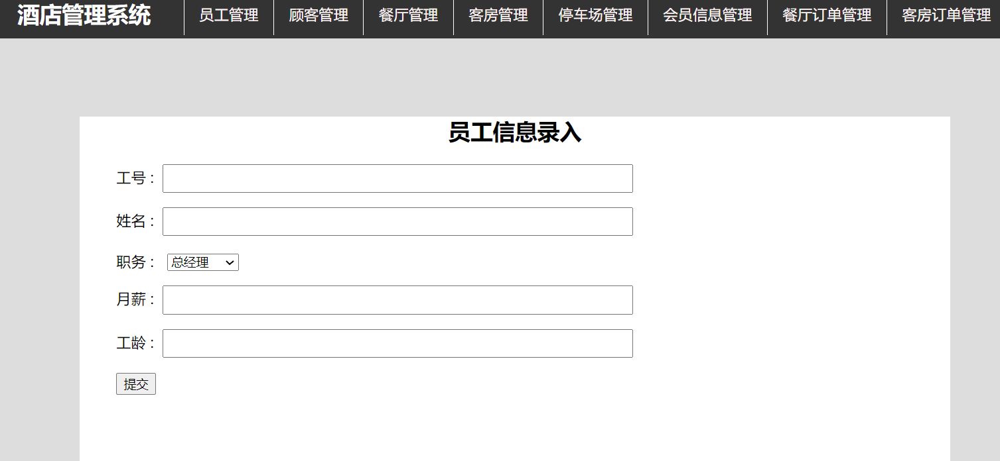
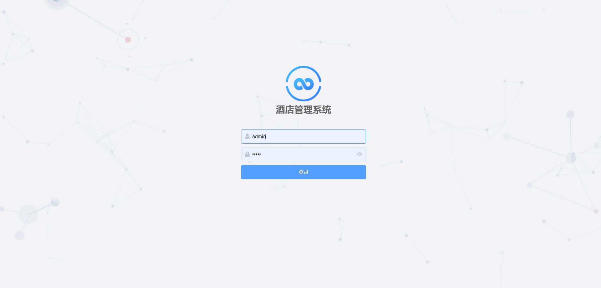
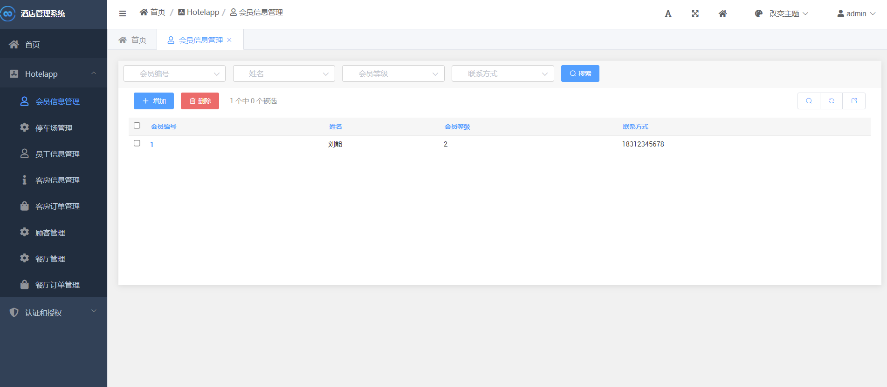
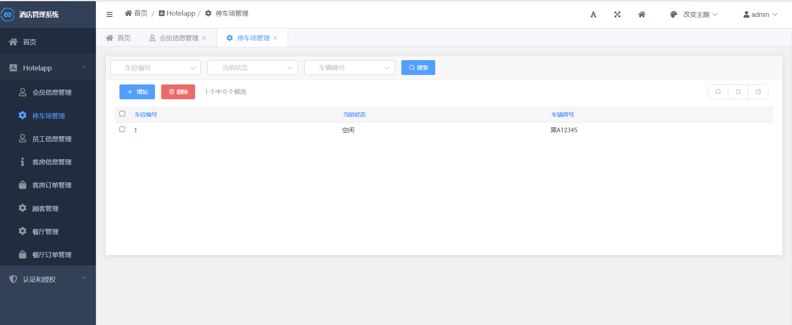
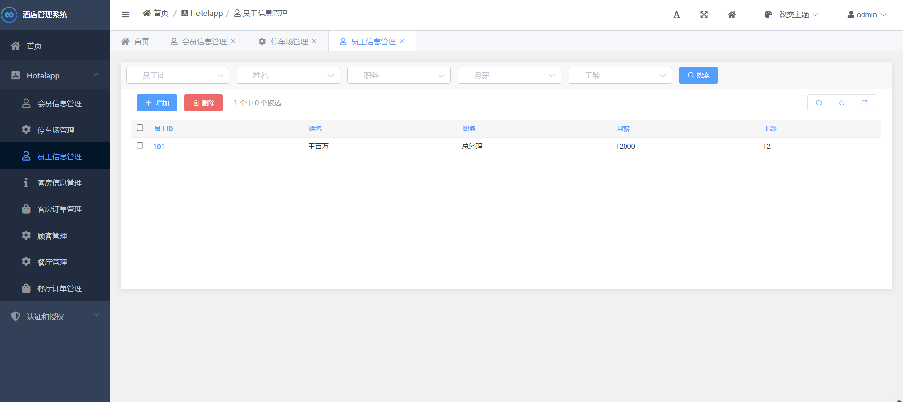
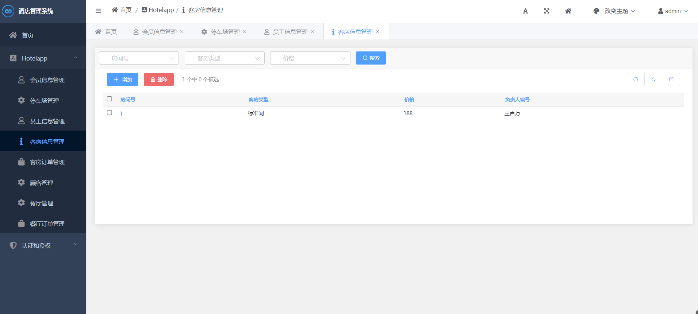
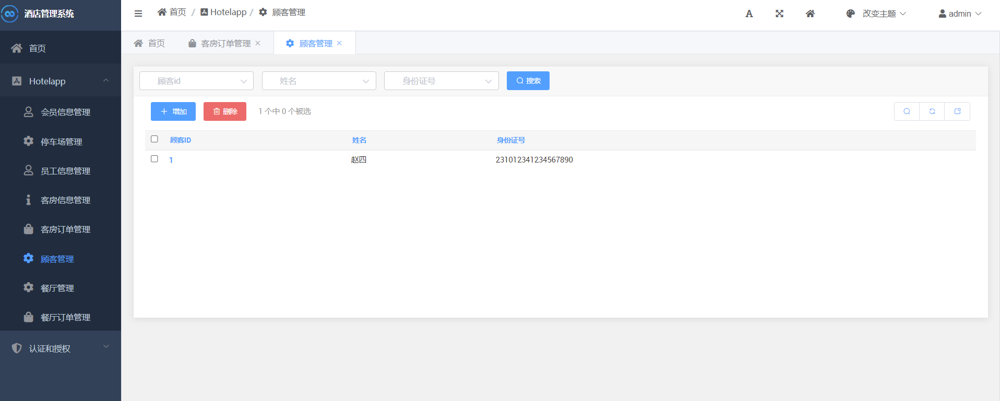
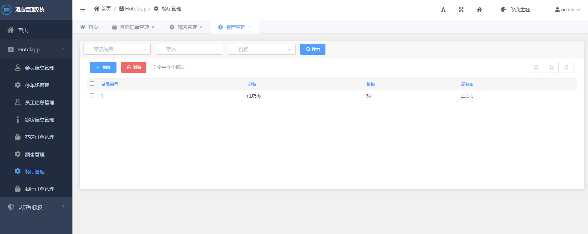
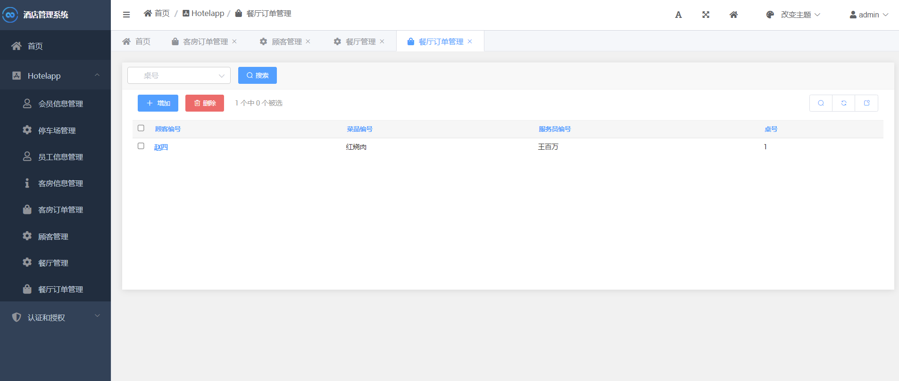

# 酒店管理项目

[](https://github.com/Pad0y/Django2_dailyfresh/blob/master/LICENSE)[](https://github.com/Pad0y/Django2_dailyfresh)[](https://blog.csdn.net/weixin_44510615)[](https://github.com/Pad0y/Django2_dailyfresh/actions)

该项目是基于Django技术开发的一套酒店管理系统，系统应用浏览器/服务期（Browser/Server）架构。系统主要包括员工用户功能和管理员用户功能两部分。开发员工信息管理、顾客信息管理、会员信息管理、停车场信息管理、餐厅信息管理、客房信息管理、餐饮订单管理、客房订单管理等功能，管理人员只需要操作系统就可以快捷、方便地完成对酒店管理的各项任务。

## 项目需求

1. 员工信息管理模块：管理员成功登录系统，进入员工管理页面对员工信息进行增加、删除、修改和查询。
2. 顾客信息管理模块：管理员成功登录系统，进入顾客管理页面对顾客信息进行增加、删除、修改和查询。同时展示所有顾客的基本信息。
3. 会员信息管理模块：管理员成功登录系统，进入会员管理页面对会员信息进行增加、删除和修改，管理员可根据条件进行综合查询和浏览会员信息。
4. 停车场信息管理模块：管理员成功登录系统，进入停车场管理页面对车辆信息进行增加、修改和删除，同时可以进行信息的查询和浏览。
5. 餐厅信息管理模块：管理员可对菜品信息进行添加、修改和删除操作。
6. 客房信息管理模块：管理员成功登录系统，进入客房信息管理页面对客房信息进行新增、修改、删除和查询操作。
7. 餐饮订单信息管理模块：管理员成功登录系统，进入餐饮订单管理页面录入新增的订单数据，修改订单信息，浏览订单当前状态。
8. 客房管理模块：维护管理包括增删改查功能。可以根据客房订单编号、菜名、客房订单价格、厨师编号等基本信息查询客房订单的基本信息。

## 项目技术

前端技术：主要是 html 和css，没有使用过多的js

后端技术：主要是django，管理系统采用的django-admin开发，页面是采用了django*-*simpleui开发，

django*-*simpleui是一个基于element-ui+vue开发的主题,重写和优化90%以上的页面。非常好用。数据存储采用mysql。

## 开发环境

```text
Language: Python>=3.6
Framework: Django 2.x
IDE: Pycharm
OS: windows 10
```

## 部署

1. 创建环境，安装依赖

   ```bash
   # Create a virtual environment with conda
   conda create -n django python=3.7 --yes
   # Install the dependent libraries
   pip install -U pip
   pip install -r requirements.txt
   ```

2. 修改settings.py配置文件

   ```python
   1. 修改数据库配置信息
   DATABASES = {
       'default': {
           'ENGINE': 'django.db.backends.mysql',
           'NAME': 'hotel', #数据库名称
           'USER': 'root', # 链接数据库的用户名
           'PASSWORD': '123456', # 链接数据库的密码
           'HOST': 'localhost', # mysql服务器的域名和ip地址
           'PORT': '3306', # mysql的一个端口号,默认是3306
       }
   }
   ```

3. 创建数据库

   ```sql
   CREATE DATABASE `hotel` CHARACTER SET 'utf8mb4';
   ```

   在hotel数据库导入hotel.sql文件 

6. 启动

   ```bash
   # Database migration and generate tables
   python manage.py makemigrations
   python manage.py migrate
   # create the super administrator account
   # python manage.py createsuperuser createsuperuser 这里再sql默认有了，账号密码都是admin
   # launch
   python manage.py runserver
   ```

## 效果

访问 http://127.0.0.1:8000/index/ 




访问 http://127.0.0.1:8000/admin/ 

账号密码都是admin

















## 后言

别忘了来个start:star:~~~，需要毕设的，提供技术服务，CSDN可私我


 
